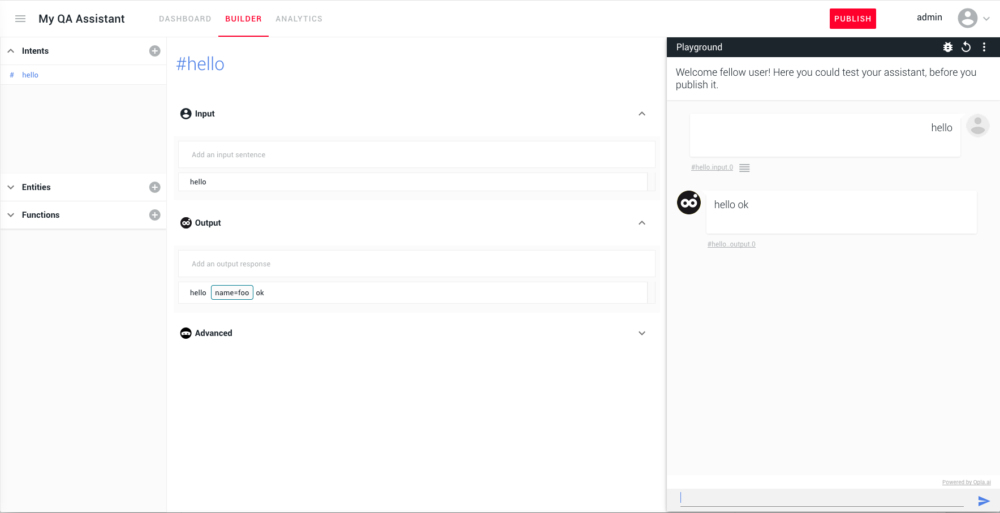

<div align="center">
  <a href="https://opla.ai" target="_blank">
    
  </a>
</div>
<h1 align="center">
  [Deprecated] Opla
</h1>
<h4 align="center">An amazing solution for creating chatbots :robot: or virtual assistants without coding. <br><code>FULLY opensource</code> </h4>

<p align="center">
  <a href="https://circleci.com/gh/Opla/opla" target="_blank">
    
  </a>
  <a href="https://gitter.im/Opla/community" target="_blank"></a>
</p>

<p align="center">
  <a href="#features">Features</a> •
  <a href="#how-to-install">How To install</a> •
  <a href="#contributing">Contributing</a> •
  <a href="#license">License</a>
</p>

<p align="center">
:zap:<code>Actual release is : v0.2 - Blooming Barboiry</code>:zap:

</p>


<div align="center">
  <a href="https://opla.ai" target="_blank">
    
  </a>
</div>

## Features

We want to create the most powerful and easiest tool for chatbot and virtual assistants creation, nurturing, analyzing and management. It gives you a total control on your robot, using transparent and free technology.

It combines:
- A cool graphical interface
- In-house NLP engine embedded :fire: ([openNLX](https://github.com/openNLX,openNLX)), transparency : no dependencies to any NLP api nor black tricks
- Connectors to publish to Webchat and Facebook Messenger (soon available other platforms)
- webhooks and plugins integration
- Playground to instantly test your intents
- Analytics


We are working hard to add new features:
- Entities editor
- An interactive flow and scenarios display
- A better playground debugger
- other conversational UI components
- And more candies
- You could also [request a feature](https://github.com/Opla/opla/issues/new?template=feature_request.md)

### Development

Opla is framed by a frontend and a backend. For details about development in each of those, please see [front/README.md](front/README.md) and [backend/README.md](backend/README.md).

We are using Javascript ES2018+, React, Node.js and other top notch tools.

## How to install

### Run locally with docker-compose

The quickest way to run opla locally is to follow [this guide](docker/README.md)


### Deploy to your own Kubernetes cluster

#### Requirements
You will need :

- (**required**) a Kubernetes cluster with LoadBalancer support. 
- (**required**) [`nginx-ingress-controller`](https://github.com/helm/charts/tree/master/stable/nginx-ingress) with an IP. Even better if you have a domain name pointing to that IP.
- (**required**) `kubectl` locally
- (**required**) [`myke`](https://github.com/goeuro/myke/) (a yaml version of `make`/Makefile) locally. See [here](https://github.com/goeuro/myke/releases) for installation.`
- (**required**) [`tiller`, `helm`](https://docs.helm.sh/using_helm/)
- (optional) [`cert-manager`](https://github.com/helm/charts/tree/master/stable/cert-manager) for let's encrypt certificates, if needed.
- (optional) [`external-storage/snapshots`](https://github.com/kubernetes-incubator/external-storage/tree/master/snapshot) for snapshots and backups of your database, if you need them.

### Helm charts
Helm charts get published at https://opla.github.io/opla
You can fetch charts this way : 
```
helm repo add opla https://opla.github.io/opla
helm repo update
helm fetch opla/opla-front opla/opla-backend
```

**Install and deploy with helm**
You can then install opla like any other helm application, and edit configuration by specifying your [values.yaml](https://github.com/Opla/front/blob/master/charts/opla-front/values.yaml) or using `helm --set ...`.

```
export API_DOMAIN=<YOUR_API_DOMAIN>
export FRONT_DOMAIN=<YOUR_FRONT_DOMAIN>
export NAMESPACE=test #to change if needed 
helm upgrade --install --namespace ${NAMESPACE} \
  --set namespace=${NAMESPACE} \
  --set api.domain=${API_DOMAIN} \
  --set front.domain=${FRONT_DOMAIN} \
  front opla/opla-front

helm upgrade --install --namespace ${NAMESPACE} \
  --set namespace=${NAMESPACE} \
  --set api.domain=${FRONT_DOMAIN} \
  backend opla/opla-backend
```

You can use `--set api.domain=$IP.xip.io` `--set front.domain=$IP.xip.io` as domain name if you only have an IP for your loadbalancer. 

Your app is then available at http://${NAMESPACE}.${FRONT_DOMAIN}

In general, if you need more details about how we deploy opla, you can have a look at our [CircleCI config.yaml](.circleci/config.yml), where we run commands to deploy it.


## Contributing
Please, see the [CONTRIBUTING.md](CONTRIBUTING.md) file.

### Contributor Code of Conduct
Please note that this project is released with a [Contributor Code of
Conduct](http://contributor-covenant.org/). By participating in this project you
agree to abide by its terms. See [CODE_OF_CONDUCT.md](CODE_OF_CONDUCT.md) file.


## License

opla-front is released under the GPL v2.0+ License. See the bundled
[LICENSE](LICENSE) file for details.
